# FAMSUN Academy Auto-Play Assistant

A powerful Tampermonkey userscript that automates video playback on FAMSUN Academy with smart course-switching detection and countdown timer management.

## Features

### 🎬 Core Functionality
- **Automatic Video Playback**: Automatically plays videos at 2x speed
- **Smart Speed Control**: Maintains 2x playback speed throughout the video
- **Automatic Course Switching**: Detects course changes and seamlessly transitions to the next video
- **Countdown Timer Management**: Keeps playback alive when system countdown is running, completes only when timer ends

### 🔧 Technical Features
- **Multi-Player Support**: Compatible with JW Player, CyberPlayer, VideoJS, Petrel (Haiyan), and native HTML5 video
- **Course Detection**: Intelligent course switching detection via:
  - URL path changes
  - Browser history changes (pushState/replaceState/popstate)
  - Video element mutations
  - Video source changes
- **Fallback Mechanism**: Uses system countdown timer when video duration is unavailable
- **User Activity Simulation**: Simulates mouse and keyboard activity to prevent focus loss detection

### ⏱️ Countdown Timer Features
- Parses countdown in multiple formats: "2小时 2分钟 30秒" (hours/minutes/seconds)
- Maintains playback during countdown (rewinds to ~1% if video stops)
- Prevents auto-jump until countdown reaches zero or countdown panel disappears
- Tracks countdown state across monitoring cycles to avoid stale data leakage

## Installation

### Step 1: Install Tampermonkey
1. Go to your browser's extension store:
   - **Chrome**: [Chrome Web Store - Tampermonkey](https://chrome.google.com/webstore/detail/tampermonkey/dhdgffkkebhmkfjojejmpbldmpobela)
   - **Firefox**: [Firefox Add-ons - Tampermonkey](https://addons.mozilla.org/firefox/addon/tampermonkey/)
   - **Safari**: [App Store - Tampermonkey](https://apps.apple.com/app/tampermonkey/id1482490089)
2. Click "Install" and confirm the installation

### Step 2: Install the Script
1. Go to [Greasy Fork](https://greasyfork.org) or [OpenUserJS](https://openuserjs.org)
2. Search for "FAMSUN Academy Auto-Play" or manually install:
   - Open Tampermonkey dashboard
   - Click "+" (Create new script)
   - Copy the entire content of `famsun_auto_video.user.js`
   - Paste into the editor
   - Press Ctrl+S (Cmd+S on Mac) to save
   - Enable the script in Tampermonkey dashboard

## Usage

### Basic Operation
1. Navigate to any video course on FAMSUN Academy
2. The script will automatically detect the content type (video/PDF)
3. For videos:
   - The control panel appears in the top-right corner
   - Click the "Start" button or enable auto-start in settings
   - The script will automatically play at 2x speed
   - Progress is displayed in real-time
4. For PDFs:
   - The script automatically scrolls through the document
   - Countdown timer requirement is monitored

### Control Panel
The control panel displays:
- **📹 Playback Progress**: Current percentage and time
- **⏱ System Requirement**: Remaining countdown time required
- **⚡ Speed**: Current playback speed (2x)
- **Auto-Next Checkbox**: Toggle automatic course switching

### Keyboard Shortcuts (Future Feature)
- `Ctrl + Alt + S`: Start/Stop playback
- `Ctrl + Alt + N`: Jump to next course
- `Ctrl + Alt + P`: Pause/Resume

## Configuration

### Settings Menu
Right-click the Tampermonkey icon → Dashboard → Find "FAMSUN Academy" → Settings

**Available Options:**
- `autoStart` (default: true): Automatically start playback when entering a course
- `playbackSpeed` (fixed: 2.0): Video playback speed (2x faster)
- `autoNext` (default: true): Automatically proceed to next course when current completes
- `simulateActivity` (default: true): Simulate user activity to prevent focus loss
- `debugMode` (default: false): Enable debug logging in console
- `minWatchPercent` (default: 95): Minimum percentage to watch before course is marked complete

### Environment Variables
```javascript
// In Tampermonkey dashboard, you can modify these GM_getValue calls:
GM_getValue('autoStart', true)          // Auto-start playback
GM_getValue('autoNext', true)           // Auto-jump to next course
GM_getValue('simulateActivity', true)   // Simulate user activity
GM_getValue('debugMode', false)         // Show debug logs
GM_getValue('minWatchPercent', 95)      // Minimum watch percentage
GM_getValue('pdfScrollInterval', 3000)  // PDF scroll interval (ms)
GM_getValue('pdfScrollStep', 500)       // PDF scroll distance (pixels)
```

## How It Works

### Video Playback Flow

```mermaid
graph TD
    A["👤 User enters course page"] --> B["🔍 Detect content type<br/>Video/PDF"]
    B --> C{Content<br/>Type?}
    C -->|Video| D["🎬 Find video player<br/>JW/Cyber/VideoJS/Native"]
    C -->|PDF| E["📄 Initialize PDF controller"]
    D --> F["⚙️ Set playback speed to 2x"]
    F --> G["▶️ Start video playback"]
    E --> H["📜 Start auto-scrolling PDF"]
    G --> I["⏱️ Monitor system countdown"]
    H --> J["⏱️ Monitor system countdown"]
    I --> K{Countdown > 0?}
    J --> K
    K -->|Yes| L["🔄 Keep playback active<br/>Rewind if stopped"]
    K -->|No| M["✅ Mark course complete"]
    L --> N{Countdown<br/>reached zero?}
    N -->|No| L
    N -->|Yes| M
    M --> O{Auto-next<br/>enabled?}
    O -->|Yes| P["🔗 Jump to next course"]
    O -->|No| Q["🛑 Stop"]
    P --> A
    Q --> Q
```



### Countdown Management

```mermaid
graph TD
    A["🎬 Video ends"] --> B["⏱️ System countdown<br/>still active<br/>e.g., 2:30"]
    B --> C["📊 Monitor every 1 second"]
    C --> D{Video<br/>stopped?}
    D -->|Yes| E["⏪ Rewind to ~1%"]
    D -->|No| F["✓ Continue playing"]
    E --> G["⏱️ Check cooldown<br/>8 seconds"]
    G --> H{Cooldown<br/>expired?}
    H -->|Yes| I["▶️ Resume playback"]
    H -->|No| J["⏸️ Wait for cooldown"]
    I --> K{Countdown = 0 or<br/>panel disappeared?}
    J --> K
    F --> K
    K -->|Yes| L["✅ Complete course"]
    K -->|No| M["🔄 Continue monitoring"]
    M --> D
    L --> N["🔗 Auto-jump to next"]
```



### Course Detection Mechanism

```mermaid
graph TD
    A["📍 Page Change Detected"] --> B{Detection<br/>Source?}
    B -->|URL Path Changed| C["🔄 Pathname differs"]
    B -->|pushState/replaceState| D["🔄 Navigation event"]
    B -->|popstate| E["🔄 Browser back/forward"]
    B -->|Video Element| F["🔄 New video element"]
    B -->|Video Source| G["🔄 Different src URL"]
    C --> H["🔍 Validate real change<br/>Compare normalized URLs<br/>& course IDs"]
    D --> H
    E --> H
    F --> H
    G --> H
    H --> I{Is this a<br/>real course<br/>switch?}
    I -->|No| J["⏭️ Skip - internal update"]
    I -->|Yes| K["🛑 Stop current playback"]
    K --> L["⏳ Wait 3 seconds<br/>for new page load"]
    L --> M["🔄 Detect new content type"]
    M --> N["⚙️ Initialize new controller"]
    N --> O{Auto-start<br/>enabled?}
    O -->|Yes| P["🚀 Auto-play new course"]
    O -->|No| Q["⏸️ Waiting for user"]
    P --> R["✅ Course switch complete"]
    Q --> R
    J --> S["✓ Continue current course"]
```



### Multi-Player Detection & Speed Control

```mermaid
graph TD
    A["🎯 Detect Player Type"] --> B{Check<br/>players}
    B -->|JW Player container| C["✅ JW Player found"]
    B -->|cyberplayer object| D["✅ CyberPlayer found"]
    B -->|videojs instance| E["✅ VideoJS found"]
    B -->|Petrel marker| F["✅ Petrel found"]
    B -->|video element| G["✅ Native HTML5"]
    C --> H["⚙️ Set 2x Speed"]
    D --> H
    E --> H
    F --> H
    G --> H
    H --> I["📊 Try multiple methods"]
    I --> J["Method 1: UI Click<br/>Most reliable"]
    I --> K["Method 2: Player API<br/>setPlaybackRate"]
    I --> L["Method 3: Video element<br/>playbackRate property"]
    I --> M["Method 4: Global object<br/>window.cyberplayer"]
    J --> N{Speed<br/>set?}
    K --> N
    L --> N
    M --> N
    N -->|Yes| O["✅ Verify speed"]
    N -->|No| P["🔄 Retry up to 3x"]
    P --> N
    O --> Q{Actual speed<br/>≈ 2x?}
    Q -->|Yes| R["✅ Success!"]
    Q -->|No| S["⚠️ Warning: Speed mismatch"]
```



### System Architecture


### Countdown State Machine


## Troubleshooting

### Script Not Starting
1. **Check if Tampermonkey is enabled**
   - Click Tampermonkey icon → Dashboard
   - Verify "FAMSUN Academy Auto-Play Assistant" is enabled

2. **Check if you're on the correct domain**
   - Script only runs on: `https://academy.famsungroup.com/*`

3. **Clear browser cache**
   - Ctrl+Shift+Delete → Clear all cookies and cached images
   - Refresh the page

4. **Check console for errors**
   - Press F12 → Console tab
   - Look for red error messages with "[FAMSUN助手]" prefix

### Video Not Playing
1. **Ensure JavaScript is enabled**
   - Check browser settings: Settings → Privacy & Security → JavaScript

2. **Check if video player is detected**
   - Press F12 → Console
   - Type: `document.querySelector('video')` 
   - Should return an element (not null)

3. **Try manual playback**
   - Click the video player's play button manually
   - Then enable the script

### Speed Not Changing to 2x
1. **Check current speed**
   - Press F12 → Console
   - Type: `document.querySelector('video').playbackRate`
   - Should show: `2` (or close to 2)

2. **Manual speed adjustment**
   - Right-click video → Speed settings
   - Check if site allows speed changes

3. **Enable debug mode**
   - Right-click Tampermonkey → Dashboard → Settings
   - Enable `debugMode: true`
   - Check console for speed-related messages

### Countdown Timer Issues
1. **Countdown not detected**
   - Press F12 → Console
   - Type: `document.querySelector('.yxtbiz-language-slot')?.textContent`
   - Check if timer text appears

2. **Auto-jump happening too early**
   - Ensure countdown timer is visible on screen
   - Check if countdown format matches supported patterns

3. **Playback not resuming during countdown**
   - Check debug logs for "倒计时" (countdown) messages
   - Verify video element is accessible

## Debug Mode

Enable debug mode to see detailed logs:

1. Right-click Tampermonkey icon → Dashboard
2. Find "FAMSUN Academy Auto-Play Assistant" script
3. Click Edit
4. Find: `debugMode: GM_getValue('debugMode', false)`
5. Change to: `debugMode: true`
6. Press Ctrl+S to save
7. Open browser console (F12) to see logs

**Sample Debug Output:**
```
[FAMSUN助手 10:30:45] 🔍 开始检测播放器类型...
[FAMSUN助手 10:30:45] ✅ 找到 JW Player 播放器
[FAMSUN助手 10:30:46] 🎯 设置播放速度为 2x (播放器: jwplayer, 第1次)
[FAMSUN助手 10:30:47] 📊 速度设置完成: ✅ UI按钮点击 | ✅ JWPlayer.setPlaybackRate() | ✅ video.playbackRate
```

## Performance Impact

- **Memory**: ~2-5 MB (minimal)
- **CPU**: <1% when idle, ~3-5% during active playback
- **Network**: No additional requests
- **Compatibility**: Works with all modern browsers (Chrome 60+, Firefox 55+, Safari 11+)

## Known Limitations

1. **PDF Scrolling**: PDF progress is measured by time elapsed and scroll position, not content understanding
2. **Live Streams**: Not designed for live video streams
3. **DRM Content**: May not work with highly encrypted video content
4. **iframe Videos**: Videos loaded in third-party iframes may not be detected
5. **Speed Restrictions**: Some courses may have server-side restrictions on playback speed

## Browser Compatibility

| Browser | Version | Status |
|---------|---------|--------|
| Chrome | 60+ | ✅ Fully Supported |
| Firefox | 55+ | ✅ Fully Supported |
| Safari | 11+ | ✅ Fully Supported |
| Edge | 79+ | ✅ Fully Supported |
| Opera | 47+ | ✅ Fully Supported |

## Legal Disclaimer

This script is provided as-is for educational and personal use only. Users are responsible for complying with FAMSUN Academy's terms of service. The script author is not responsible for any consequences resulting from its use.

## Version History

### v1.3.28 (Latest)
- ✅ Optimized countdown timer management
- ✅ Smart course-switching detection
- ✅ Improved playback state tracking
- ✅ Enhanced error handling and logging

### v1.3.10
- ✅ Enhanced button detection with retry mechanism
- ✅ Improved player type detection

### v1.0.0
- ✅ Initial release

## Contributing

To contribute improvements:
1. Fork the repository
2. Create a feature branch: `git checkout -b feature/your-feature`
3. Make your changes
4. Test thoroughly on various courses
5. Submit a pull request with detailed description

## Support & Feedback

For issues, feature requests, or suggestions:
- Open an issue on [GitHub Issues](https://github.com/CamelKing1997/AutoAcademy/issues)
- Check the console (F12) for debug messages
- Enable debug mode for more detailed logs

## License

MIT License - See LICENSE file for details

---

**Last Updated**: November 6, 2025  
**Maintained By**: AutoAcademy Contributors  
**Repository**: [GitHub - AutoAcademy](https://github.com/CamelKing1997/AutoAcademy)
